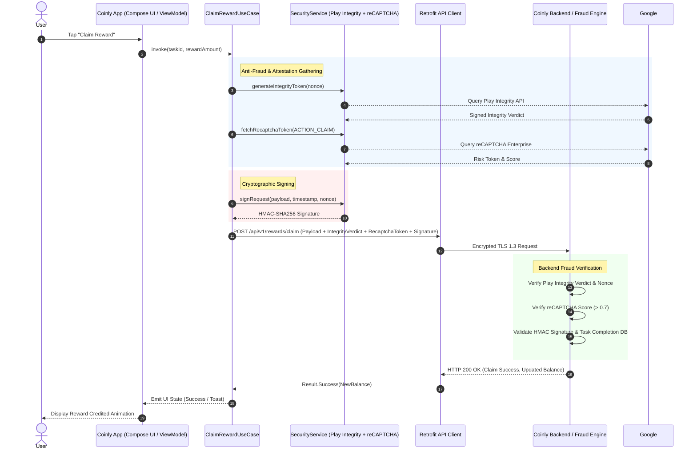

# Coinly Rewards App — Engineering Design Note & Architecture
 
> **Stack**: Kotlin, Jetpack Compose, Kotlin Coroutines & Flow, Koin DI, Retrofit/OkHttp  

---

## 1. Executive Summary

Coinly is a fictional mobile rewards platform where users complete micro-tasks (e.g., app installs, surveys) to earn coins, which can subsequently be redeemed for cash payouts. As Coinly scales, **fraud farms** (automated scripts, device emulators, rooted/jailbroken devices, VPN proxies, and intercepted/replayed HTTP requests) represent our primary cost center and revenue threat.

This design note outlines the production architecture and anti-fraud mitigation strategies for Coinly's **"Claim Reward"** flow, adhering strictly to **Clean Architecture**, **OWASP Mobile Application Security (MASVS)** guidelines, and official Google APIs (**Play Integrity** & **reCAPTCHA Enterprise**).

---

## 2. Architecture & Tech Stack

Coinly strictly follows **Clean Architecture** principles, decoupling business logic from UI frameworks and network drivers.

```
┌────────────────────────────────────────────────────────┐
│                      Presentation                      │
│        (Jetpack Compose UI, ViewModels, Flows)         │
└──────────────────────────┬──────────────────────────────┘
                           │ communicates via UseCases
┌──────────────────────────▼──────────────────────────────┐
│                         Domain                         │
│   (Business Models, Use Cases, Repository Interfaces)  │
└──────────────────────────▲──────────────────────────────┘
                           │ implements interfaces
┌──────────────────────────▼──────────────────────────────┐
│                          Data                          │
│   (Retrofit API, Play Integrity, Local Cache, Repos)   │
└────────────────────────────────────────────────────────┘
```

### Key Stack Constraints & Principles:
- **Dependency Injection**: **Koin** is used exclusively for lightweight, constructor-based dependency injection without annotation processing overhead.
- **Concurrency**: **Kotlin Coroutines & Flow** power asynchronous pipelines with strict structured concurrency (`viewModelScope`, supervisor scopes, and lifecycle-aware collection). **`GlobalScope` is strictly prohibited.**
- **UI Framework**: **Jetpack Compose** with Material 3. **No XML layouts are permitted for new UI.**
- **Exclusions**: No Room, DataStore (encrypted secure storage used where needed), RxJava, or Hilt.
- **Security & Logging**: **Never log secrets, tokens, or PII.** Retrofit HTTP logging interceptors must redact authorization headers and payload tokens in production builds.

---

## 3. Threat Model & Anti-Fraud Strategies for "Claim Reward"

Fraudulent actors employ various vectors to drain reward pools. Below is our threat matrix and mitigation blueprint aligned with **OWASP MASVS (Resilience & Architecture)**:

| Threat Vector | Description | Mitigation Strategy | OWASP MASVS Ref |
| :--- | :--- | :--- | :--- |
| **Emulators & Simulators** | Running scripts on Android emulators to mass-claim rewards. | **Play Integrity API** (`recognizedEmulator` verdict checks) + Build fingerprint inspection. | MASVS-RESILIENCE-1 |
| **Rooted / Tampered Devices** | Disabling SSL pinning, hooking runtime (`Frida`/`Xposed`), modifying client memory. | **Play Integrity API** (`MEETS_STRONG_INTEGRITY` / `MEETS_DEVICE_INTEGRITY`) + SafetyNet/RootBeer heuristics + obfuscation (R8/ProGuard). | MASVS-RESILIENCE-2, 3 |
| **VPN & Proxy Interception** | Routing traffic through intercepting proxies (Charles/Burp) to tamper with reward payloads. | **OkHttp Certificate Pinning** + Network Security Config (`cleartextTrafficPermitted = false`) + IP Geo/ASN threat intelligence on backend. | MASVS-NETWORK-1, 2 |
| **Scripted & Bot Claims** | Automated HTTP requests bypassing UI interaction entirely. | **reCAPTCHA Enterprise for Android** (invisible risk scoring) + Cryptographic challenge-response tokens. | MASVS-CODE-1 |
| **Replayed Requests** | Re-sending captured valid reward claim requests multiple times. | **Request Nonces & HMAC Request Signing** (timestamp + ephemeral nonce + payload hash signed with a device-attested key). | MASVS-AUTH-2 |

---

## 4. End-to-End "Claim Reward" Flow & Verification Sequence

The diagram below illustrates the secure request lifecycle when a user initiates a reward claim.



---

## 5. Clean Architecture Implementation Details

### Domain Layer
- **`ClaimRewardUseCase`**: Coordinates the business rules. It requests device attestation tokens, builds the signed request entity, and invokes the repository.
- **`RewardRepository`**: Interface defining `claimReward(taskId: String, attestation: AttestationData): Flow<Resource<CoinBalance>>`.

### Data Layer
- **`RewardRepositoryImpl`**: Implements repository interface, orchestrates Retrofit API calls, handles error mapping, and interacts with `SecurityService`.
- **`SecurityServiceImpl`**: Wraps Google Play Integrity API client, reCAPTCHA Enterprise SDK, and local root/emulator heuristics.

### Presentation Layer
- **`RewardViewModel`**: StateFlow-backed ViewModel managing UI state (`ClaimUiState`: `Idle`, `Loading`, `Success`, `Error`). Adheres strictly to unidirectional data flow (UDF).

---

## 6. OWASP MASVS Compliance Checklist

1. **MASVS-STORAGE-1**: All sensitive tokens and session identifiers are stored in `EncryptedSharedPreferences` backed by Android Keystore.
2. **MASVS-CRYPTO-1**: All cryptographic operations utilize standard algorithms (AES-GCM-256 for local encryption, HMAC-SHA256 for request signing). No hardcoded keys.
3. **MASVS-AUTH-2**: Biometric or PIN checks required for high-value coin redemptions.
4. **MASVS-NETWORK-1**: TLS 1.3 enforced, strict certificate pinning implemented via OkHttp `CertificatePinner`.
5. **MASVS-RESILIENCE-1**: App detects root access (`su` binary presence, test-keys) and custom ROMs, terminating session if compromised.
6. **MASVS-RESILIENCE-2**: R8 compiler configured with aggressive code shrinking, obfuscation, and anti-tamper checks.

---
